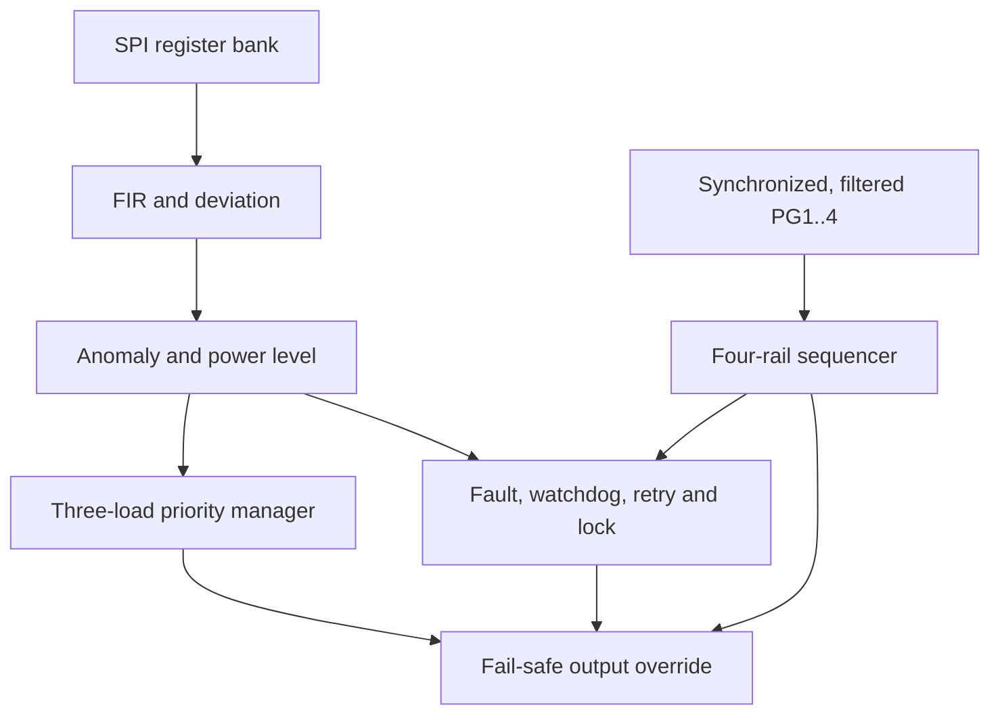

# CTW-SPMS

CTW-SPMS is a programmable, all-digital Smart Power Management and Supervisor
for Tiny Tapeout TTSKY26c in a SKY130 1x2 tile. The design uses the 10 MHz
Tiny Tapeout clock as its only RTL clock domain.

The chip accepts digital samples and status signals from external ADC,
comparator, and supervisor circuitry. It contains no analog measurement block.

## Architecture



Implemented frozen features:

- multiplier-free four-tap FIR, absolute deviation, programmable warning and
  severe-anomaly persistence
- programmable HIGH, MEDIUM, LOW, and CRITICAL power classifier
- explicit 2-flip-flop synchronization and assertion filtering for PG1..PG4
- four-rail ordered startup, PG wait states, startup timeout, RUN PG-loss
  detection, and ordered reverse shutdown
- three-load prompt shedding and one-at-a-time restoration
- deterministic fault priority, hard shutdown, latched diagnostics, watchdog,
  automatic retry, retry exhaustion, and FAULT_LOCK
- SPI Mode 0 programmable register bank and readable operating status
- final combinational safety override that no sequencer or load decision can
  bypass

## Tiny Tapeout pin map

| Pin | Direction | Function |
|---|---|---|
| `ui[0]` | input | PG1 |
| `ui[1]` | input | PG2 |
| `ui[2]` | input | PG3 |
| `ui[3]` | input | PG4 |
| `ui[4]` | input | OVERCURRENT |
| `ui[5]` | input | OVERTEMP |
| `ui[6]` | input | WATCHDOG_IN toggle/edge heartbeat |
| `ui[7]` | input | FORCE_SHUTDOWN_EXT |
| `uo[0]` | output | RAIL1_EN |
| `uo[1]` | output | RAIL2_EN |
| `uo[2]` | output | RAIL3_EN |
| `uo[3]` | output | RAIL4_EN |
| `uo[4]` | output | LOAD1_EN, highest priority |
| `uo[5]` | output | LOAD2_EN |
| `uo[6]` | output | LOAD3_EN, lowest priority |
| `uo[7]` | output | latched FAULT |
| `uio[0]` | output | SPI_MISO |
| `uio[1]` | input | SPI_CS_N |
| `uio[2]` | input | SPI_SCLK |
| `uio[3]` | input | SPI_MOSI |
| `uio[7:4]` | input | unused |

`uio_oe` is always `8'h01`; unused outputs are always zero. Tiny Tapeout `ena`
is synchronized and acts as a final system/output permission. Configuration and
SPI status remain clocked, but rails and loads are forced OFF while synchronized
`ena` is LOW.

## SPI interface

- Mode 0: CPOL=0, CPHA=0
- MSB first
- maximum SCLK: 2 MHz with the 10 MHz project clock
- one transaction is exactly 16 SCLK rising edges under CS_N LOW
- byte 0: bit 7 is READ=1/WRITE=0; bits 6:0 are the address
- byte 1: write data on MOSI or read data on MISO
- CS_N HIGH aborts an incomplete frame
- clocks after a complete frame are ignored until CS_N returns HIGH
- writes commit atomically with a one-core-clock strobe

SPI_SCLK is not an RTL clock. CS_N, SCLK, and MOSI pass through explicit 2-FF
synchronizers, and protocol edge detection runs entirely on `clk`. Keep CS_N
HIGH for at least three project clocks between frames.

The single authoritative address/default table is
[docs/register-map.md](docs/register-map.md).

## Signal processing

Only a completed write to `POWER_SAMPLE` advances the unsigned FIR:

```text
y[n] = (x[n] + x[n-1] + x[n-2] + x[n-3]) >> 2
```

The accumulator is explicitly 10 bits. The first write fills all four taps, so
the first filtered result equals the first sample without a startup transient.
Before that write, FIR-valid is LOW and the classifier reports CRITICAL. The
deviation block performs a safe unsigned absolute difference between the
filtered sample and `POWER_NOMINAL`.

Anomaly counters advance only on completed POWER_SAMPLE writes, require
consecutive filtered samples, and saturate at 255. A configured persistence of
zero or one qualifies on the first matching sample. Anomaly
status is observable while disabled, but a severe anomaly enters the fault path
only while `SYSTEM_ENABLE` and synchronized `ena` request operation.

## Rail and PG behavior

`PG_STABLE_COUNT`, `STARTUP_TIMEOUT`, and `SEQUENCE_DELAY` all use the
shared 10 kHz clock-enable, so one count is 100 us. `SEQUENCE_DELAY` is also
the load-restoration delay. Zero sequence delay adds no intentional wait;
`STARTUP_TIMEOUT=0` disables startup timeout.

Both PG assertion and deassertion require the programmed number of consecutive
synchronized 100 us samples, preventing a short pulse in either direction from
changing the qualified state. `PG_STABLE_COUNT=0` qualifies after one sampled
tick. In RUN, PG-loss priority is PG1, PG2, PG3, then PG4.

Normal startup is RAIL1 -> RAIL2 -> RAIL3 -> RAIL4 -> RUN. Normal removal of
`SYSTEM_ENABLE` powers down RAIL4 -> RAIL3 -> RAIL2 -> RAIL1. A hard fault,
force shutdown, reset, or inactive `ena` bypasses ordinary timing and forces all
final rail/load outputs LOW.

## Load policy

| Power level | LOAD1 | LOAD2 | LOAD3 |
|---|---:|---:|---:|
| HIGH | ON | ON | ON |
| MEDIUM | ON | ON | OFF |
| LOW | ON | OFF | OFF |
| CRITICAL | OFF | OFF | OFF |

Shedding applies at the next core clock. Recovery restores one missing load at
a time in priority order after each 100 us `SEQUENCE_DELAY`; loads never turn
on merely because reset was released and are permitted only in RUN.

## Fault and retry policy

Simultaneous fault priority is:

1. OVERTEMP
2. OVERCURRENT
3. qualified POWER_ANOMALY
4. STARTUP_TIMEOUT
5. PG1_LOSS
6. PG2_LOSS
7. PG3_LOSS
8. PG4_LOSS
9. WATCHDOG_TIMEOUT

Every accepted event increments the saturating `FAULT_COUNT` and updates
`LAST_FAULT`. `FAULT_DETAIL` records the rail number for startup-timeout and
PG-loss faults. A critical event immediately activates the final safety
override, then latches FAULT.

`CLEAR_FAULT` is a self-clearing command pulse. It is ignored while an active
level fault remains. It does not erase historical `LAST_FAULT` or `FAULT_COUNT`.

`RETRY_DELAY` and `WATCHDOG_TIMEOUT` use the shared 10 kHz clock-enable tick, so
one count is 100 us. There is no generated clock. After a fault, outputs remain
safe for `RETRY_DELAY`, then startup may retry if the source is absent. A source
that remains active keeps the fault latched and consumes no retry attempt.
After `MAX_RETRY` failed attempts, the controller enters FAULT_LOCK and stays
safe until a valid clear. Retry exhaustion never overwrites the physical root
cause in `LAST_FAULT`. `MAX_RETRY=0` disables automatic retry and leaves the
fault latched for manual clear. A successful return to RUN ends the retry
episode; the displayed retry count is retained for diagnostics until clear or
the next independent episode.

The watchdog is active only in RUN when its control bit and the fault policy
permit operation. Either heartbeat edge/toggle resets its timer, and
`WATCHDOG_TIMEOUT=0` disables watchdog timeout.

## Reset and illegal-state behavior

Active-low reset deterministically produces:

```text
RAIL_EN = 0000
LOAD_EN = 000
FAULT   = 0
uio_oe  = 00000001
```

Safety-critical FSM state and counters have explicit reset. An illegal rail FSM
encoding recovers to OFF with all sequencer rails disabled. The two-bit fault
controller uses all four binary encodings; its lock state stays safe until a
valid clear.

## Verification

Run the deterministic RTL regression with:

```sh
cd test
make clean
make
```

The regression covers all required scenario classes, including all four startup
timeouts and RUN PG losses, PG glitches, staged loads, anomaly persistence,
single transient rejection, simultaneous OT-over-OC priority, watchdog, retry
success/failure/exhaustion, zero boundaries, saturation, active reset, illegal
rail-state recovery, SPI framing, configuration effects, and output invariants.

CI additionally runs Tiny Tapeout GDS hardening, the project signoff-policy
gate, precheck, and gate-level tests. The release criteria, audited evidence,
and bounded electrical waiver are recorded in
[docs/tapeout-signoff.md](docs/tapeout-signoff.md).

## Attribution and license

RTL in this repository is a clean CTW-SPMS-native implementation licensed under
Apache-2.0. Architectural concepts were informed by the Tiny Tapeout
`tt_um_signal_detector` and `tt_um_load_priority_controller` projects; no source
code was copied from them.

The frozen scope deliberately excludes UART, I2C, PMBus, PWM, dead-time and PI
controllers, on-chip ADC, CPU/RISC-V, AI/BNN, and BIST.
